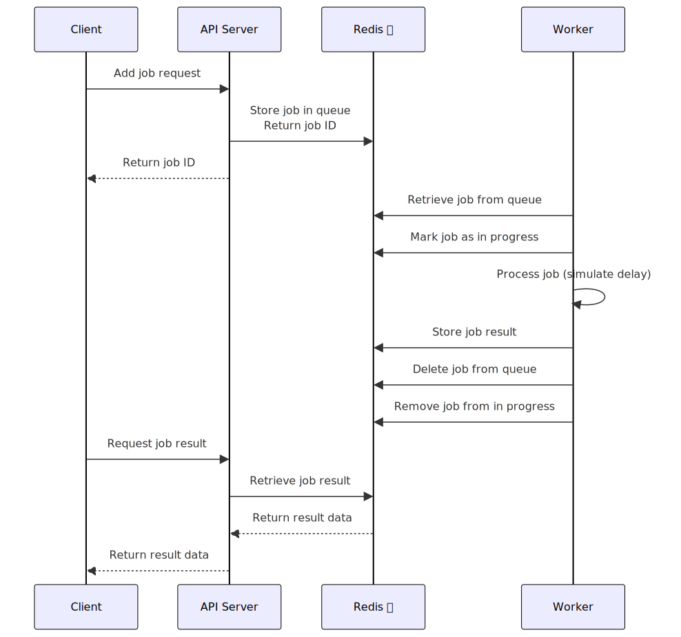
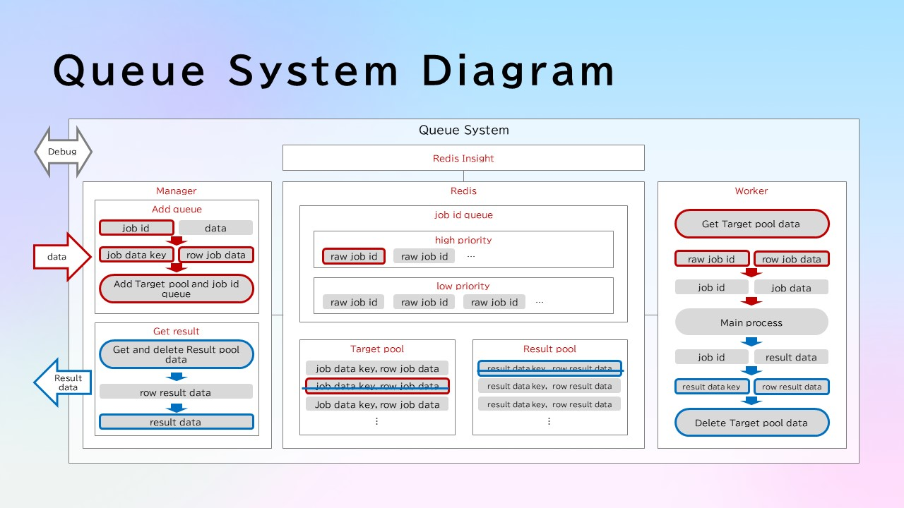

## About

Sample Queue System

1. Create .env file

2. Build docker image

```bash
# build api server
cd ./api_server
docker build -t queue-system-api-server .

# build worker
cd ./worker
docker build -t queue-system-worker .
```

3. Start container

```bash
docker compose up -d
```

4. Create and activate virtual environment

```bash
conda create --name queue_system_client python=3.11 -y
conda activate queue_system_client
```

5. Run sample_client.py

```bash
cd ./api_server
python ./sample_client.py
```

6. Check monitor of cache server

- Access the following url

```url
# CACHE-SERVER-MONITOR-PORT: set at .env
http://localhost:CACHE-SERVER-MONITOR-PORT/
```

- Click [Add Redis database]
- Enter the following items

```
Host: cache-server-container
Database Alias: Your optional name
Username: default
Password: CACHE_SERVER_PASSWORD set at .env
```

## Sequence Diagram



## System Diagram


