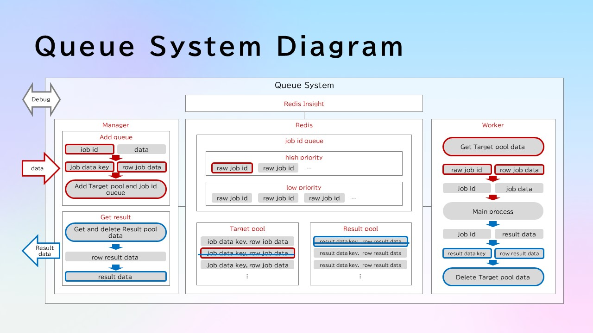

## About

Sample Queue System

1. Create .env file

2. Build docker image

```bash
# build manager
cd ./manager
docker build -t queue-system-manager .

# build worker
cd ./worker
docker build -t queue-system-worker .
```

3. Start container

```bash
docker compose up -d
```

4. Create and activate virtual environment

```bash
conda create --name queue_system_client python=3.11 -y
conda activate queue_system_client
```

5. Run sample_client.py

```bash
cd ./manager
python ./sample_client.py
```

6. Check and debug queue system on redis insight

- Access the following url

```url
# REDIS-PORT: on your env
http://localhost:REDIS-PORT/
```

- Click [Add Redis database]
- Enter the following items

```
Host: redis-container
Database Alias: Your optional name
Username: default
Password: Your .env setting
```

## Sequence Diagram


## System Diagram


